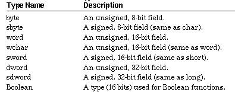

# 1\. Basic Data Types and Structures

In addition to the standard data types available in C, the Goc preprocessor handles several other types specific to GEOS. These are all defined in the file **geos.h**. Some of these types, shown below, were carried over from the world of assembly language. 

The Boolean type behaves as most Boolean types--any nonzero value represents a ``true`` state, and zero represents the ``false`` state. Throughout the documentation, ``true`` and ``false`` are taken to be these meanings. Note that the constants TRUE and FALSE are defined and may be used as return values from your functions and methods. Do not compare Boolean variables, however, against these constants. A Boolean may be ``true`` without actually equaling the TRUE value.

* [Records and Enumerated Types](GOCLanguage_2.md)
* [Handles and Pointers](GOCLanguage_3.md)
* [Fixed Point Structures](GOCLanguage_4.md)
